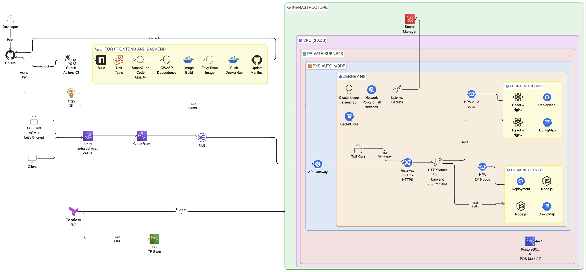

# 🛤️ Jerney — Real-Time Blog Platform (DevSecOps Edition)

A Gen-Z vibe blog platform initially built as a standard 3-tier web app, now fully transformed into a **production-grade, scalable, and secure microservices architecture** deployed on AWS EKS.

This repository serves as a showcase of modern **DevSecOps practices**, **Infrastructure as Code (IaC)**, and **GitOps-driven Continuous Delivery**.


---

## 🏗️ Architecture



---

## 🚀 DevSecOps & Cloud Features

### 1. Infrastructure as Code (Terraform) ☁️
- **AWS VPC:** Custom network across 3 AZs with Public/Private subnets and NAT Gateways.
- **EKS Auto Mode:** Fully managed Kubernetes v1.35 cluster with 8 essential addons (CoreDNS, EBS CSI, VPC CNI, cert-manager, metrics-server).
- **RDS PostgreSQL 16:** Multi-AZ deployment, encrypted at rest, auto-scaling storage.
- **CDN & DNS:** CloudFront CDN caching with Route53 DNS and ACM-validated SSL certificates. `/api/*` paths bypass cache for real-time reads.

### 2. Continuous Integration & Security (GitHub Actions) 🔄
Multi-stage, path-filtered CI pipelines for both Frontend and Backend, featuring:
- **Build & Test:** Multi-stage Docker builds minimizing image footprints (Alpine base).
- **Security Gates:**
  - **OWASP Dependency Check:** Fails build on High/Critical vulnerabilities (CVSS ≥ 7).
  - **SonarQube:** Enforces code quality gates with hard timeouts.
  - **Trivy Image Scanning:** Scans container images and automatically uploads SARIF reports directly to the **GitHub Security Tab**.
- **Automated Manifest Updates:** Secure, concurrent Git push logic with race-condition retries to update `helm/values.yaml` with the latest Docker image tags.

### 3. GitOps Continuous Delivery (Argo CD) 🐙
- **Single Source of Truth:** Argo CD continuously monitors the `helm/` directory in this repository.
- **Automated Sync & Self-Healing:** Instantly detects configuration drift and auto-heals cluster resources back to the desired Git state.
- **Dynamic Configuration:** Database hosts, IRSA roles, and VPC CIDRs are dynamically injected from Terraform into Argo CD via Helm parameters.

### 4. Production-Grade Kubernetes & Security ⎈
- **Gateway API:** Utilizing NGINX Gateway Fabric with `HTTPRoutes` for advanced path-based routing (e.g., `/api` to backend, `/` to frontend) and TLS termination.
- **Zero-Trust Secrets (IRSA):** External Secrets Operator (ESO) fetches secure credentials directly from AWS Secrets Manager using OIDC identity. No static credentials exist in the cluster.
- **Container Hardening:** 100% of pods run in restricted security contexts:
  - `runAsNonRoot: true` (UIDs 1000/101)
  - `readOnlyRootFilesystem: true`
  - `allowPrivilegeEscalation: false`
- **Network Isolation:** Strict `NetworkPolicies` control all Ingress/Egress traffic between services and restrict backend outbound traffic strictly to RDS.
- **Auto-Scaling (HPA):** Horizontal Pod Autoscalers dynamically scale frontend (2-5 pods) and backend (2-10 pods) based on CPU utilization thresholds.

---

## 📁 Repository Structure

```text
Jerney/
├── .github/workflows/       # GitHub Actions CI pipelines (frontend-ci.yml, backend-ci.yml)
├── argocd/                  # Argo CD GitOps Application manifest
├── backend/                 # Node.js Express API source code + Dockerfile
├── frontend/                # React (Vite) frontend source code + Dockerfile
├── helm/                    # Kubernetes Helm charts (Infrastructure, Frontend, Backend)
├── terraform/               # AWS Infrastructure as Code (VPC, EKS, RDS, S3 State)
└── README.md
```

---

## 🧑‍💻 Local Development

### Prerequisites
- Node.js 20+
- PostgreSQL 16+

### Backend Setup
```bash
cd backend
npm install

# Create a .env file
export DB_HOST=localhost
export DB_PORT=5432
export DB_USER=jerney_user
export DB_PASSWORD=jerney_pass
export DB_NAME=jerney_db
export PORT=5000

npm start
```

### Frontend Setup
```bash
cd frontend
npm install
npm run dev
```
*The Vite dev server starts on `http://localhost:3000` and proxies `/api` requests to the backend.*

---

## 📡 API Endpoints

| Method | Endpoint | Description |
|--------|----------|-------------|
| GET | `/api/health` | Service health check & readiness probe target |
| GET | `/api/posts` | Retrieve paginated posts |
| POST | `/api/posts` | Create a new blog post |
| GET | `/api/comments/post/:postId` | Fetch post comments |
| POST | `/api/comments` | Submit a comment |

---

Built to demonstrate the power of **DevSecOps** and **Cloud-Native Automation**. 🚀
